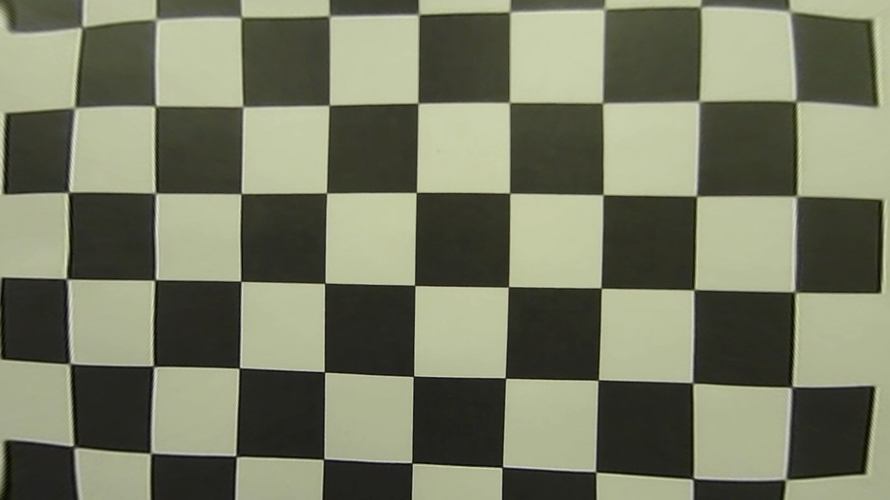
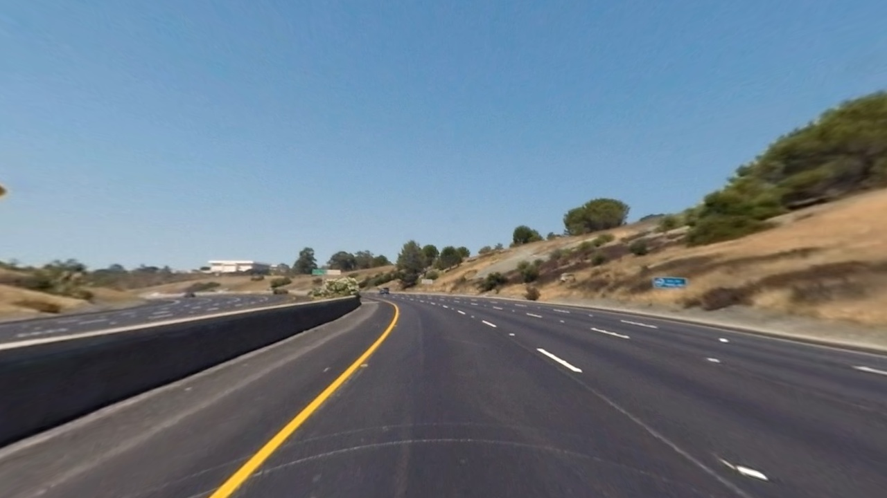

##Advanced Lane Finding Project

The goals / steps of this project are the following:

* Compute the camera calibration matrix and distortion coefficients given a set of chessboard images.
* Apply a distortion correction to raw images.
* Use color transforms, gradients, etc., to create a thresholded binary image.
* Apply a perspective transform to rectify binary image ("birds-eye view").
* Detect lane pixels and fit to find the lane boundary.
* Determine the curvature of the lane and vehicle position with respect to center.
* Warp the detected lane boundaries back onto the original image.
* Output visual display of the lane boundaries and numerical estimation of lane curvature and vehicle position.

---
###Camera Calibration

####1. How to compute the camera matrix and distortion coefficients and an example of a distortion corrected calibration image.

The code for this step is contained in the **code cell 1 of the IPython notebook** located in "./P4_advanced_lane_finding.ipynb".  

I start by preparing "object points", which will be the 3D (x, y, z) coordinates of the chessboard corners in the world space. Here I am assuming the chessboard is fixed on the (x, y) plane at z=0, such that the object points are the same for each calibration image.  Thus, `objp` is just a replicated array of coordinates, and `objpoints` will be appended with a copy of it every time I successfully detect all chessboard corners in a test image using the `cv2.findChessboardCorners()` function.  `imgpoints` will be appended with the (x, y) pixel position of each of the corners in the image plane with each successful chessboard detection.  

In **code cell 2**, I then used the output `objpoints` and `imgpoints` to compute the camera calibration and distortion coefficients using the `cv2.calibrateCamera()` function. The results were saved for later use to a pickle file located in "./distortion_correction_pickle.p". 

I applied this distortion correction to the camera calibration image using the `cv2.undistort()` function and saved the results in "./output_images" where the distortion-corrected image is prefixed with "undist_": 





###Pipeline

####1. Examples of distortion-corrected images.
Using `cv2.undistort()` in **code cell 2**, I applied the distortion correction to a series of test images and the results were save to "./output_images" where each of the distortion-corrected images is prefixed with "undist_". 





####2. Use color transforms, gradients, etc., to create a thresholded binary image.
I used a combination of color and gradient thresholds to generate a binary image in **code cell 4 in the iPython notebook**.  There are 3 sub components that made up the final binary image. First, I converted the color space of the image from RGB to HSV. To identify yellow line,  I used color thresholding with the H channel and the S channel, where the H (Hue) threshold has the range of (14, 24) and the S (Saturation) threshold has the range of (75, 255). Second, to identify white line, I used a similar strategy with different thresholds, where the H threshold has the range of (0, 179) and the S threshold has the range of (1, 25), except that I "ANDed" the result with the gradient in the x direction since we are more interested in lines that are closer to vertical. Lastly, since white line tends to have high value in V channel, I added the V threshold with the range of (200, 255). All three sub component are either "ANDed" or "ORed" with a gradient in the x direction.

Here's an example of my output for this step using the test image from ''./test_images/test5.jpg'


####3. Apply the perspective transform to convert the binary image to a birds-eye view.

The function for the perspective transform is called `perspective_unwarp()`, which appears in **code cell 5 in the IPython notebook**.  The `perspective_unwarp()` function processes an image (`img`), with the source (`src`) and destination (`dst`) points.  Choosing source and destination points took a little bit of trial and error. Typically, you will want to pick the source points that would form a rectangle in the warped image. I ended up with the following source and destination points.

| Source        | Destination   | 
|:-------------:|:-------------:| 
| 576, 460      | 320, 0        | 
| 705, 460      | 960, 0      |
| 1102, 705     | 960, 720      |
| 180, 705      | 320, 720        |

I verified that my perspective transform was working as expected by drawing the `src` and `dst` points onto a test image and its warped counterpart to verify that the lines appear parallel in the warped image. The following 2 images illustrate this point.


####4. Detect lane pixels and use polynomial fitting to find the lane boundary.

Now that we have a birds eye view of the binary image, it's time to find the lane lines. The function `polynomial_fit()` that detects and fits the lines appears in **code cell 7 in the IPython notebook**. Processing the first image, we take a histogram of the bottom half of the image, then find the peak of the left and right halves of the histogram. The peaks will be the starting point for the left and right lines. Next we use a sliding window method to find the white pixels that belong to the lane lines. Vertically, there are 9 windows. Each window has a +/- `margin` of 100, effective making its size as 200 (100+100). Whenever there are over `minpix=1500` number of pixels detected in the window, we recenter the next window on these pixels' mean position. The search process is repeated for every window. At the end, the x and y coordinates within each window that were found to have nonzero pixels are identified. Using such coordinates, we applied `np.polyfit()` function to fit a second order polynomial for the left and right lane lines.
To speed up the process, once we have found the lane lines, we skipped the blind window search method. Instead, we searched around a window near previously detected lines. Once again, when nonzero pixels are identified, their x and y coordinates are used by `np.polyfit()` to fit the polynomial. Here is an example of the polynomial fitted lane lines using the test image located in './test_images/test5.jpg'


####5. Calculate the radius of curvature of the lines and the position of the vehicle with respect to center.

I used the function `get_radius_of_curvature()` to calculate the radius of the curvature. The formula was provided by Udacity lesson as the following


The function takes the a line object as an input, and plug-in the coefficients of the 2nd order polynomial. In addition, meters per pixel in both x and y dimensions were used so that the resulting radius maps to meters in the world space.

```
def get_radius_of_curvature(binary_warped, line):
    ploty = np.linspace(0, binary_warped.shape[0]-1, binary_warped.shape[0] )
    y_eval = np.max(ploty)
    radius = 0
    # Fit new polynomials to x,y in world space
    fit_cr = np.polyfit((line.ally)*ym_per_pix, (line.allx)*xm_per_pix, 2)
    # Calculate the new radii of curvature
    radius = ((1 + (2*fit_cr[0]*y_eval*ym_per_pix + fit_cr[1])**2)**1.5) / np.absolute(2*fit_cr[0])

    return radius
```

Here is how the position of the vehicle relative to the lane center is calculated. The function `measure_offset_from_lane_center()` is located at **code cell 10 in the IPython notebook**.  First, the vertical center line of the image is assumed to be the position of the vehicle since we believe the camera is center mounted. Second, using the fitted line, we plug-in the height of the image as y to obtain x. The midpoint of the two x coordinates is the lane center and the offset can be calculated by subtraction.​​ 
​​ 

####6.  Warp the detected lane boundaries back onto the original image.

I implemented this step in **code cell 12 in the IPython notebook**.  
In the function `map_lane()`, a decision was made to either use the x values of the current fitted line or the "best fit" which is the average x values of the fitted line over the last n iteration. 
A crucial part of the implementation was provided by Udacity lesson shown below. The code snippet recasts the x and y points into usable format for `cv2.fillPoly()`. We then use the inverse transform matrix to warp the result back to the original image.

```
warp_zero = np.zeros_like(binary_warped).astype(np.uint8)
    color_warp = np.dstack((warp_zero, warp_zero, warp_zero))

    # Recast the x and y points into usable format for cv2.fillPoly()
    pts_left = np.array([np.transpose(np.vstack([left_fitx, ploty]))])
    pts_right = np.array([np.flipud(np.transpose(np.vstack([right_fitx, ploty])))])
    pts = np.hstack((pts_left, pts_right))

    # Draw the lane onto the warped blank image
    cv2.fillPoly(color_warp, np.int_([pts]), (0,255, 0))
```

Here is an example of my result on a test image:


---

###Pipeline (video)

####1. The final video output can be viewed with the following links.

[Dropbox link](https://www.dropbox.com/s/f586jwtxm51lsfy/finished_project_video.mp4?dl=0)


---

###Discussion

####1. Briefly discuss any problems / issues you faced in your implementation of this project.  Where will your pipeline likely fail?  What could you do to make it more robust?

One of the first major challenges of this project is to create a stable image thresholding pipeline so that a well fitted polynomials can be identified in the binary image. This pipeline appears to work very well most of the time, except when vehicle makes transition from the asphalt to cement pavement.

The second major challenge is to perform sanity check on the fitted line and decide if we should use it directly or use the data from previous frames. 

The sanity check function `line_check()` was implemented in **code cell 11 in the IPython notebook**. It returns a boolean to indicate if the result is okay. Three critiria were used.

* Both lines should curve in the same direction.
* Both lines should have similar curvature.
* Both lines are separated by approximately the right distance horizontally.

In addition, the `line_check()` function accumulates x values data from previous fitted lines. Once there are enough samples, the function calculates the arithmetic mean of the x values and stores them in the `bestx` attribute of the `Line` object for later use.

In the video processing pipeline found in **code cell 15 of the IPython notebook**, function `process_image()` performs sanity check of the fitted lines for each frame. If the sanity check fails, we switch back to use the last fitted line. Before line fitting, the last fitted line object was duplicated using `copy.deepcopy()` function. By applying this strategy, we improve the animation when the vehicle passes through the two cement pavement area.

The current pipeline are not yet able to handle the 2 challenge videos. More work is to be done in the color and gradient thresholding pipeline to create more robust binary image. A different sanity check strategy needs to be developed to cope with the double center lines, and the disappearing white line. For example, if the right line disappears, but the left line is detected and passes sanity check, we can duplicate the left line to the right side and still plot the lane boundaries. This could provide better continuity from frame to frame.

